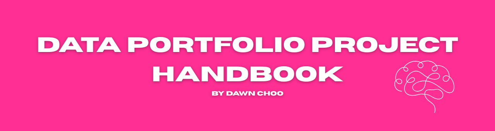

# Dawn's Data Portfolio Project Handbook

 

Every resource & guidance you need to build your Data Science & Analytics portfolio

Are you building a Data Science & Analytics portfolio or already working on one, this repo is for you!

You'll find a ton resources to guide you from the initial stages of ideation all the way through to creating a polished, professional portfolio. This portfolio is what you can showcase to hiring managers, discuss in interviews, and highlight on your resume, so that you can ultimately land your dream Data Science or Data Analyst job!

If you're starting to build your portfolio from scratch I recommend following this guide step-by-step. But if you're here looking for specific resources or looking to up-level your data portfolio, feel free to jump to the relevant sections.

## Table of Contents

1. [Project planning & ideation](#project-planning--ideation)
   * [Where to find datasets](#where-to-find-datasets)
     * [Static datasets](#static-datasets)
     * [Data APIs](#data-apis)
2. [A list of project ideas by role and skill level](#a-list-of-project-ideas-by-role-and-skill-level)
   * [Guided project resources](#guided-project-resources----start-here-if-youre-building-your-first-project)
   * [Datasets + project ideas](#datasets--project-ideas)
     * [YouTube Content Strategy Optimization](#youtube-content-strategy-optimization)
     * [Mental Health Treatment Gap](#mental-health-treatment-gap)
     * [Delivery Performance & Customer Satisfaction Analysis](#delivery-performance--customer-satisfaction-analysis)
     * [Fast Food Nutrition](#fast-food-nutrition)
     * [Airbnb Listings and Reviews](#airbnb-listings-and-reviews)
     * [Summer Olympics](#summer-olympics)
     * [Movies](#movies)
     * [Mental Health](#mental-health)
     * [More project ideas](#more-project-ideas)
3. [Skills to showcase for each role](#skills-to-showcase-for-each-role)
4. [Tools & tech stack](#tools--tech-stack)
   * [SQL](#sql)
   * [Python](#python)
   * [Excel](#excel)
   * [Data visualization](#data-visualization)
5. [Hosting your portfolio](#hosting-your-portfolio)

*By the way, HI 👋 My name is Dawn Choo. I am a Data Scientist and a Data content creator. I write every day on LinkedIn and Instagram to 100k+ followers. I also have a newsletter (about Data careers) where I publish a new article every other Wednesday — sign up here at www.askdatadawn.com. Because I have written extensively about this topic across all of my platforms, you might find that I link to some of my posts & newsletters! My goal, however, is to make this repo as comprehensive as possible, so I include link from a wide range of resources.*

## Project planning & ideation

A data "portfolio" typically contains multiple projects. Before we discuss creating the full portfolio, let's focus on building individual projects. This section provides instructions for finding datasets, developing project ideas, exploring sample projects, and following guided tutorials to help you get started.

### Where to find datasets

**Static datasets**

* **General Dataset Repositories**
  * [Kaggle](https://www.kaggle.com/datasets) - this is my go-to for finding datasets. They have a huge selection with datasets across all topics, plus you can see other people's projects and join competitions
  * [Google Dataset Search](https://datasetsearch.research.google.com/), like Google but specifically for datasets
  * [AWS Open Data](https://registry.opendata.aws/)
  * [Papers with Code Datasets](https://paperswithcode.com/datasets)
  * [GitHub Awesome Public Datasets](https://github.com/awesomedata/awesome-public-datasets) - someone curated this list of datasets and I love it!
* **Government & Official Data**
  * [Data.gov](https://www.data.gov/) - US government's open data portal (300k+ datasets)
  * [European Union Open Data Portal](https://data.europa.eu/en) (almost 2million datasets)
  * [UK Government Data](https://data.gov.uk/)
  * [Canada Open Data](https://open.canada.ca/en)
  * [World Bank Open Data](https://data.worldbank.org/)
  * [UN Data](http://data.un.org/)
  * [OECD Data](https://data.oecd.org/)
  * [US Census Bureau](https://data.census.gov/)
  * [Bureau of Labor Statistics](https://www.bls.gov/data/)
* **Academic & Research Data**
  * [UCI Machine Learning Repository](https://archive.ics.uci.edu/ml/index.php) - Classic ML datasets
  * [Harvard Dataverse](https://dataverse.harvard.edu/) - Research data repository
* **Specialized Domain Data**
  * [Yahoo Finance](https://finance.yahoo.com/) - Financial market data
  * [FRED Economic Data](https://fred.stlouisfed.org/) - Federal Reserve economic data
  * [OpenWeatherMap](https://openweathermap.org/api) - Weather data
  * [NASA Open Data](https://data.nasa.gov/) - Space and earth science data
  * [National Institute of Health](https://www.nih.gov/health-information/nih-clinical-research-trials-you) - Health and medical data
  * [Sports Reference](https://www.sports-reference.com/) - Sports statistics
  * [MovieLens](https://grouplens.org/datasets/movielens/) - Movie rating datasets

**Data APIs**

* **Social Media APIs**
  * [Twitter API](https://developer.twitter.com/en/docs) - Tweet data and social metrics
  * [Reddit API](https://www.reddit.com/dev/api/) - Reddit posts and comments
  * [YouTube Data API](https://developers.google.com/youtube/v3) - Video metadata and statistics
  * [Instagram Basic Display API](https://developers.facebook.com/docs/instagram-basic-display-api) - Instagram media data
* **Financial APIs**
  * [Alpha Vantage](https://www.alphavantage.co/) - Stock market and financial data
  * [IEX Cloud](https://iexcloud.io/) - Financial data API
  * [Quandl](https://www.quandl.com/) - Economic and financial data
  * [CoinGecko API](https://www.coingecko.com/en/api) - Cryptocurrency data
* **Government & Public APIs**
  * [Census Bureau APIs](https://www.census.gov/data/developers/data-sets.html) - US demographic data
  * [OpenWeatherMap API](https://openweathermap.org/api) - Weather and climate data
  * [NASA APIs](https://api.nasa.gov/) - Space and earth observation data
  * [Disease.sh API](https://disease.sh/) - COVID-19 and disease statistics
* **News & Content APIs**
  * [News API](https://newsapi.org/) - News articles from various sources
  * [Guardian API](https://open-platform.theguardian.com/) - The Guardian newspaper data
  * [New York Times API](https://developer.nytimes.com/) - NYT articles and data
* **Other Useful APIs**
  * [REST Countries](https://restcountries.com/) - Country information
  * [OpenFDA](https://open.fda.gov/) - FDA drug and food data
  * [World Bank API](https://datahelpdesk.worldbank.org/knowledgebase/articles/889386) - Global development indicators

### How to come up with a project idea

I wrote about this in [this LinkedIn post](https://www.linkedin.com/feed/update/urn:li:activity:7335319829869928452/).

I also highly recomend writing [an analysis plan](https://www.linkedin.com/feed/update/urn:li:activity:7335319829869928452/) before you start any anlaysis. I find that writing an analysis plan forces me to break down my high level question in bite-sized steps. And it's also helpful when I'm working through my analysis and going off on a tangent (my analysis usually focuses me back on what is important for this project)

Not sure how to write an analysis plan? You can use my [analysis template](https://seasoned-jackrabbit-505.notion.site/Data-Analysis-Plan-Template-2017bd8f260380f6afdee63cac7d3f43?source=copy_link) to get started!

## A list of project ideas by role and skill level

### **Guided project resources -- start here if you're building your first project**

The ultimate goal would be to build completely self-driven projects, that are in your target industry. But if this is your first Data portfolio project, it could be helpful (read: less intimidating) to start with one of these guided projects!

**Exploratory Data Analysis**

* [Understanding COVID fatality with Alex Freberg](https://www.youtube.com/watch?v=qfyynHBFOsM)
* [Data Science salary projection with Ken Jee](https://www.youtube.com/watch?v=OybXWl3IWvI)
* [Analyze movie reviews with Jordan Lue](https://github.com/jordanlue/DataQuest-Guided-Projects/tree/master/Guided%20Project%20-%20Analyzing%20Movie%20Reviews)

**Data Visualization**

* [Visualize the gender gap in college degrees with Jordan Lue](https://github.com/jordanlue/DataQuest-Guided-Projects/blob/master/Guided%20Project%20-%20Visualizing%20the%20Gender%20Gap%20in%20College%20Degrees/Guided%20Project%20-%20Gender%20Gap%20in%20College%20Degrees.ipynb)
* [Building a coffee sales dashboard Mo Chen](https://www.youtube.com/watch?v=m13o5aqeCbM)
* [Analyzing Pixar movies with Jordan Lue](https://github.com/jordanlue/DataQuest-Guided-Projects/tree/master/Guided%20Project%20-%20Pixar)

**Machine Learning**

* [Data Science salary projection with Ken Jee](https://github.com/PlayingNumbers/ds_salary_proj)
* [Stock market performance analysis with Aman Kharwal](https://amanxai.com/2023/05/08/stock-market-performance-analysis-using-python/#google_vignette)
* [Real estate price prediction with Codebasics](https://www.youtube.com/playlist?list=PLeo1K3hjS3uu7clOTtwsp94PcHbzqpAdg)

**ETL + Database Design**

* [Design a database for a Pizzeria with Adam Finer](https://www.youtube.com/watch?v=0rB_memC-dA)
* [Football data engineering with Yusuf Ganiyu](https://www.youtube.com/watch?v=tKIXUqz17W8)
* [Trending YouTube videos with Darshil Parmar](https://www.youtube.com/watch?v=yZKJFKu49Dk&list=PLBJe2dFI4sgvQTNNkI3ETYJgNPR4CBpFd)

## Datasets + project ideas

### **YouTube Content Strategy Optimization**

*Dataset: [YouTube Performance + Comments Dataset](https://www.kaggle.com/datasets/advaypatil/youtube-statistics?select=videos-stats.csv&utm_source=www.askdatadawn.com&utm_medium=referral&utm_campaign=3-detailed-data-portfolio-projects-ideas-datasets)*

*More details on these project ideas [here](https://www.askdatadawn.com/p/3-detailed-data-portfolio-projects-ideas-datasets)*

**Beginner**
Identify what makes videos successful by analyzing top-performing keywords, like-to-view ratios, and average sentiment. Use an engagement score (views + likes + comments) to rank videos.

**Intermediate**
Build a performance framework to evaluate content effectiveness over time. Use percentiles, cohort analysis, and sentiment-to-performance correlations to uncover patterns and inform future strategy.

**Advanced**

* **Engagement Quality Monitor**: Detect negative sentiment spirals and flag videos needing moderation.
* **Community Health Scorer**: Create health scores by content category to prioritize response.
* **Moderator Resource Optimizer**: Allocate response efforts using sentiment and controversy levels.

### **Mental Health Treatment Gap**

*Dataset: [Global Burden of Mental Disorders](https://www.kaggle.com/datasets/imtkaggleteam/mental-health/?utm_source=www.askdatadawn.com&utm_medium=referral&utm_campaign=3-detailed-data-portfolio-projects-ideas-datasets)*

*More details on these project ideas [here](https://www.askdatadawn.com/p/3-detailed-data-portfolio-projects-ideas-datasets)*

**Beginner**
Report on mental health treatment gaps globally. Highlight untreated anxiety rates, regional depression prevalence, and country-level mental health burdens using descriptive analysis.

**Intermediate**
Track and predict treatment trends with window functions, cohort analysis, and a composite risk score to prioritize mental health intervention efforts.

**Advanced**

* **Real-Time Crisis Detection System**: Build a system that flags potential mental health emergencies early.
* **Investment Optimization Platform**: Model expected impact of different interventions across populations.
* **Equity Index Tool**: Quantify and address disparities in mental health access and outcomes.

### **Delivery Performance & Customer Satisfaction Analysis**

*Dataset: [Brazilian E-Commerce Public Dataset](https://www.kaggle.com/datasets/olistbr/brazilian-ecommerce?utm_source=www.askdatadawn.com&utm_medium=referral&utm_campaign=3-detailed-data-portfolio-projects-ideas-datasets)*

*More details on these project ideas [here](https://www.askdatadawn.com/p/3-detailed-data-portfolio-projects-ideas-datasets)*

**Beginner**
Explore how delivery performance affects customer reviews. Compare on-time delivery rates, review scores, and regional differences in performance and volume.

**Intermediate**
Build a delivery performance framework by analyzing seller rankings, customer retention by cohort, and root causes of operational delays. Include a "reliability score."

**Advanced**

* **Predictive Delivery Risk System**: Train an ML model to forecast late deliveries and simulate interventions.
* **Dynamic Delivery Promise Engine**: Personalize delivery estimates with A/B testing for effectiveness.
* **Seller Performance Platform**: Automate monitoring, diagnostics, and action recommendations for sellers.

### **Fast Food Nutrition**

*Dataset: [Fast Food Nutritional Facts](https://www.kaggle.com/datasets/utsavdey1410/food-nutrition-dataset/data?utm_source=www.askdatadawn.com&utm_medium=referral&utm_campaign=25-not-boring-data-portfolio-project-ideas)*

**Beginner**
Analyze nutritional trends across popular fast food chains. Identify healthier vs. unhealthier options using basic statistics and visualizations.

**Intermediate**
Explore nutrient relationships and build a dashboard to compare fast food items across chains based on user-defined goals.

**Advanced**

* **Clustering Analysis**: Group menu items by nutritional profile to uncover patterns.
* **Nutritional Recommendation Engine**: Suggest items based on goals like high protein or low sodium.
* **Interactive Explorer App**: Build a user-facing tool for personalized fast food comparisons.

### **Airbnb Listings and Reviews**

*Dataset: [Airbnb Listings + Reviews](https://www.kaggle.com/datasets/mysarahmadbhat/airbnb-listings-reviews/data?utm_source=www.askdatadawn.com&utm_medium=referral&utm_campaign=25-not-boring-data-portfolio-project-ideas)*

**Beginner**
Compare performance of superhosts vs. regular hosts. Analyze differences in ratings, prices, and booking frequency.

**Intermediate**
Study geographic and amenity-based trends. Use clustering and mapping to explore pricing and satisfaction across locations.

**Advanced**

* **Price Optimization Model**: Predict optimal listing prices using machine learning.
* **Listing Recommendation System**: Suggest listings based on user preferences and review scores.
* **Amenity-Based Segmentation**: Cluster listings to find patterns in offerings and outcomes.

### **Summer Olympics**

*Dataset: [Olympic Athletes + Medals](https://www.kaggle.com/datasets/divyansh22/summer-olympics-medals?utm_source=www.askdatadawn.com&utm_medium=referral&utm_campaign=25-not-boring-data-portfolio-project-ideas)*

**Beginner**
Visualize medal counts and performance trends by country and year. Explore how participation has evolved.

**Intermediate**
Analyze gender representation and dominant countries in specific sports over time. Build dashboards to highlight changes and patterns.

**Advanced**

* **Medal Count Predictor**: Use machine learning to forecast 2024 medal totals.
* **Athlete Career Analysis**: Explore patterns in longevity and versatility.
* **Demographics Enrichment**: Merge Olympic data with external datasets to uncover deeper insights.

### **Movies**

*Dataset: [Movies Metadata & Ratings](https://www.kaggle.com/datasets/asaniczka/tmdb-movies-dataset-2023-930k-movies?utm_source=www.askdatadawn.com&utm_medium=referral&utm_campaign=25-not-boring-data-portfolio-project-ideas)*

**Beginner**
Explore genre trends, production countries, and language shifts. Create time-based visualizations.

**Intermediate**
Perform sentiment analysis on movie descriptions and study how they relate to audience ratings.

**Advanced**

* **Box Office Success Predictor**: Predict movie revenue based on metadata and features.
* **Movie Recommender System**: Use collaborative filtering to suggest titles.
* **Genre Classifier**: Build a model to predict genre using descriptive features.

### **Mental Health**

*Dataset: [Global Mental Health Indicators](https://www.kaggle.com/datasets/programmerrdai/mental-health-dataset/data?utm_source=www.askdatadawn.com&utm_medium=referral&utm_campaign=25-not-boring-data-portfolio-project-ideas)*

**Beginner**
Track global prevalence of mental disorders and visualize country-level changes over time.

**Intermediate**
Analyze gender disparities and model mental health outcomes using socioeconomic variables.

**Advanced**

* **Prevalence Prediction Model**: Build and compare models for mental health forecasting.
* **Mental Health Impact Analysis**: Correlate disorder rates with DALYs to quantify burden.
* **Country Clustering**: Group nations by mental health profile using unsupervised learning.

### More project ideas

Here are more project ideas below to tickle your braincells, I have not looked for the accompanying datasets. But hey, searching for these datasets is part of the fun (and part of the process!)

* Analyze performance of each stage of the sales funnel, including lead generation, conversion rates.
* Group delivery routes for logistics companies to optimize fuel usage and delivery time.
* Build a text-based RPG game where a transformer model dynamically generates game scenarios.
* Segment retail customers based on purchase behavior to tailor marketing strategies.
* Predict housing prices based on location, size, and other property features.
* Design a schema for teams, players, match scores to allow for analytics and leaderboards.
* Develop model to classify customer reviews as positive, negative, or neutral.
* Optimize warehouse layouts to minimize order-picking times using data analysis.
* Model the relationship between advertising spending and product sales.
* Showcase historical and upcoming space missions by country, mission type & success rates.
* Build a dashboard to track trends in hashtags and sentiment over time.
* Classify whether a patient has a specific disease based on health metrics.
* Create a model that applies the style of famous paintings to user-uploaded photos.
* Analyze supply chain efficiency by identifying bottlenecks in transportation routes.
* Analyze whether a new drug improves recovery times compared to a placebo in a clinical trial.
* Evaluate which marketing strategies lead to a higher conversion rates.
* Forecast daily energy consumption for a city based on historical usage data and weather patterns.
* Predict customer churn in a subscription-based service using demographic and usage data.
* Compare open rates for two different email subject lines to determine which is more effective.
* Develop customer profiles based on travel preferences and spending history to target personalized promotions.
* Segment users by workout habits, goals, and subscription tiers for better engagement strategies.
* Analyze and forecast stock price movements for a specific company using historical market data.
* Create a real-time visualization of player performance metrics and match outcomes for a sports league.
* Design a relational database to manage products, customers, orders & payments.
* Simplify a dataset of university characteristics to uncover the main factors contributing to university rankings.
* Uncover the factors influencing dropout rates in online learning platforms.
* Predict monthly revenue for an e-commerce platform using seasonal and promotional trends.
* Simplify data from healthcare studies to identify dominant factors associated with diseases.
* Report on ticket resolution times, customer satisfaction scores, and support request volume trends.
* Create a visualization of startup funding trends by industry, region, and funding stage over time.

## Skills to showcase for each role

Every data role has it's own expectations and required skillset. Whether you're applying to Data Scientist or Data Analyst position, your portfolio needs to showcase skills that __hiring managers are looking for__. For this repo, we are only focused on Data Sience & Analytics roles, so we will not be covering other roles like Data Engineering or AI Engineering.

So for Data Science & Data Analyst roles, here are the required skills:

**Product Data Science**

* **Exploratory Data Analysis** - e.g. customer churn analysis, user behavior segmentation
* **A/B Experimentation** - e.g. feature launch impact test, email header experiment
* **Machine Learning** - e.g. recommendation engine, customer lifetime value prediction
* **Causal Inference** - e.g. marketing campaign attribution, feature adoption drivers

**Machine Learning Data Science**

* **Machine Learning**  - e.g. fraud detection system, image classification model
* **Data Preprocessing Project** - e.g. text data pipeline, missing data imputation framework
* **Model Evaluation & Tuning** - e.g. hyperparameter optimization study, cross-validation comparison
* **Big Data Technologies** - e.g. spark ML pipeline, distributed training implementation

**Data Analyst**

* **SQL** - e.g. complex joins dashboard, window functions for cohort analysis
* **Advanced Excel** - e.g. financial modeling tool, interactive pivot table dashboard
* **Data Visualization** - e.g. sales performance dashboard, customer journey visualization
* **Metric Definition & Reporting** - e.g. KPI framework design, automated reporting system

## Tools & tech stack

Of course, every product you build will require tools or platforms, like the actualy environment / program that you'll use when building your projects. We'll cover in this section what tools (*most are free or at least have a free tier*) you can use for your projects depending on the skills you're trying to showcase, plus I'll also add my personal recommendation and why.

**SQL**

* **[DBeaver](https://dbeaver.io/)** – Free, all-in-one SQL client. Works with Postgres, MySQL, SQLite, and more
* **[MySQL Workbench](https://dev.mysql.com/downloads/workbench/)** – Official SQL IDE for MySQL
* **[DB Browser for SQLite](https://sqlitebrowser.org/)** – Lightweight, no setup. Just open a file and start querying, but only good for small projects
* **[Mode](https://mode.com/), [Hex](https://hex.tech/), [PopSQL](https://popsql.com/)** – Cloud SQL editors with free tiers options
* **[BigQuery Console](https://console.cloud.google.com/bigquery)** – Google's cloud SQL workspace

My recommendation: Start with **DBeaver** + **SQLite** if you're new and working with a very small dataset (<1000 rows & <20 columns). Move to **DBeaver** (since it works with all flavors of SQL) when you're ready to work with big & multiple datasets.

**Python**

* **[Google Colab](https://colab.research.google.com/)** – Free, browser-based Jupyter notebooks with zero setup (also has Gemini AI integrated, which can be helpful)
* **[JupyterLab](https://jupyter.org/install)** – Runs locally on your computer, so you don't have to be connected to the internet
* **[Cursor](https://www.cursor.so/)** – AI-powered code editor, ideal for scripting, not notebooks.. but can make it work for analyses too
* **[JetBrains DataSpell](https://www.jetbrains.com/dataspell/)** – Professional IDE with smart completions and notebook support, but can be very $$$

My recommendation: Use with **Google Colab**—it's free, no setup, and beginner-friendly.

**Excel**

* **[Microsoft Excel](https://www.microsoft.com/en-us/microsoft-365/excel)** (duh!) – The standard desktop version, but this does cost money AND doesn't work as well on Macbooks.
* **[Excel for the Web](https://www.office.com/launch/excel)** – Free, browser-based Excel via Microsoft 365. But (be warned) this does not have all the functionality of the desktop version.
* **[Google Sheets](https://sheets.google.com/)** – Free and cloud-based with real-time collaboration. Mimics Excel very closely, but does not have all the functionality.

My recommendation: Use with **Excel** if you can afford to pay for it, if not, **Google Sheets** works great too.

**Data visualization**

* **[Tableau Public](https://public.tableau.com/)** – Free version of Tableau that lets you build interactive dashboards. But note: your dashboards must be public and functionality is limited
* **[Tableau Desktop](https://www.tableau.com/products/desktop)** – Paid version ($$), lets you keep dashboards private and access more advanced features.
* **[Power BI Desktop](https://powerbi.microsoft.com/en-us/desktop/)** – Free Microsoft tool for building dashboards (only for Windows users)
* **[Looker Studio](https://lookerstudio.google.com/)** (formerly Google Data Studio) – Free, browser-based, and integrates well with Sheets and BigQuery, but from my experience, very difficult yot use
* **Plotly / Seaborn / Matplotlib**– Python libraries for data viz. \n *Best if you're already working in Python and want to visualize inside a notebook.*
* **[Streamlit](https://streamlit.io/)** – Free, open-source Python framework that lets you turn scripts into interactive web apps. *This is fun to play with if you're bulding public, production, web-apps based* dashboards.

## Hosting your portfolio

Finally, our last step is where to host your portfolio. There are so many great options out there, so how do you pick. *Spoiler alert — I have a favorite and it's Notion (because it's free and easy-to-customize).* We'll also cover some common mistakes people make when building their portfolio and how to best present your projects in interviews.

* [Notion](https://www.notion.so) – *my top recommendation.* It's easy to use and looks good. You can include text, charts, images, links, even embed code if needed.
* [DataSciencePortfol.io](https://www.datascienceportfol.io) – Really easy to get your portfolio up and running in minutes. But there aren't many options for customization or personal branding
* [Google Slides](https://slides.google.com)– Super intuitive, especially if you're already comfortable with Docs or Slides. But you're stuck working in a slide-by-slide format, which can feel limiting.
* [Carrd](https://carrd.co) – I like that they have strater templates templates that make your portfolio look clean and modern with very little effort.

I put together this [FREE Data Portfolio template](https://seasoned-jackrabbit-505.notion.site/Data-Portfolio-Template-1617bd8f260380e4b115c17f57796af5?source=copy_link) that you can use to get started!

## Contact me

* Follow me on [Instagram](www.instagram.com/askdatadawn)… *I'm trying really hard to build out a presence on IG!*
* Follow me on [LinkedIn](www.linkedin.com/in/data-dawn)
* Check out my SQL Interview Preparation platform [Interview Master](www.interviewmaster.ai)

